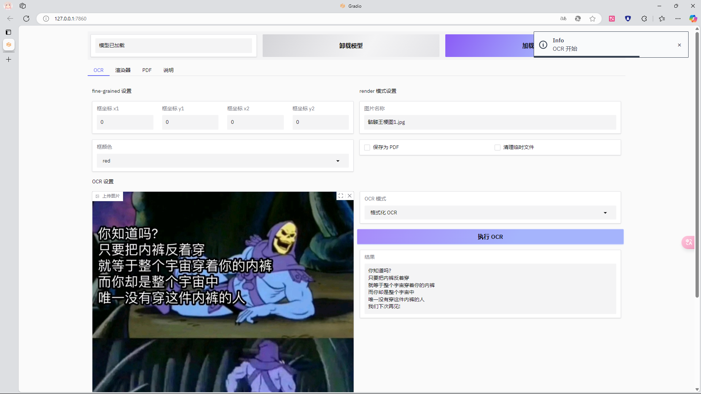

# GOT-OCR-2-GUI

## [See English version here](README-en.md)



## 关于此项目

模型权重：[镜像站](https://hf-mirror.com/stepfun-ai/GOT-OCR2_0)，[原站点](https://huggingface.co/stepfun-ai/GOT-OCR2_0)  
原GitHub：[GOT-OCR2.0](https://github.com/Ucas-HaoranWei/GOT-OCR2.0/)   
这个项目是在 Windows 下开发的，我本人没用过也不会 Linux，不能确保它能够在 Linux 下正常运行，如果你要在 Linux
下部署，可以参考一下这个 [issue](https://github.com/XJF2332/GOT-OCR-2-GUI/issues/3)  
部分代码来自：[ GLM4 ](https://chatglm.cn/main/alltoolsdetail?lang=zh)、[Deepseek](https://www.deepseek.com/)

点个star吧

## 待办

- [ ] 优化 PDF 相关的错误处理逻辑
- [ ] ⚠️支持`llama-cpp-python`，希望能够加速推理
- 遇到困难，有能力的可以提交 pr，最好可以提到 `Aplha` 分支；使用的 HuggingFace
  模型是 [kaifeise/GOT-gguf](https://huggingface.co/kaifeise/GOT-gguf/tree/main)；`GGUF Test.py`
  使用了来自 [1694439208/GOT-OCR-Inference](https://github.com/1694439208/GOT-OCR-Inference) 的代码 。文件都在`gguf`
  文件夹里了）
- [ ] html 转 word 功能，保留公式可以编辑
- 目前想到两个方法，一个是先转 PDF 然后 PDF 转 Word，但这样太慢，因为要用 selenium 打开浏览器去渲染 PDF；另一个是`pdflatex`
  ，但是这样就要再装一个 TeX 发行版，我看了一下 TexLive ，又是好几个 GB。感觉这两个方法都不太行。不知道有没有人有更好的方法？

## 使用方法

如果这里面提到的文件夹你没有，那就**新建一个**

### 依赖

此环境在**python 3.11.9**下经过测试能够正常工作

#### torch

从[torch官网](https://pytorch.org/get-started/locally/)选择适合自己的**GPU版本**的torch安装即可  
我用的是 Stable 2.4.1 + cu124 ，建议你也用这个版本

#### FlashAttention

不是强制要求，不过如果你想安装的话可以看[#12](https://github.com/XJF2332/GOT-OCR-2-GUI/issues/12)

#### PyMuPDF

实测如果直接从`requirements.txt`里安装的话会报`ModuleNotFoundError: No module named 'frontend'`
，但单独安装的话就不会这样，具体原因不清楚  
另外，如果还是报`ModuleNotFoundError`的话就先卸载`fitz`和`PyMuPDF`，再重新安装一次应该能解决，实测`pip install -U PyMuPDF`
是没用的

```commandline
pip install fitz
pip install PyMuPDF
```

#### 使用`pip`安装

```commandline
pip install -r requirements.txt
```

另，有人提到了自己使用`requirements.txt`安装依赖时出现了冲突问题，但我这里没有发现问题，`pipdeptree`
也没有显示任何冲突项，`requirements.txt`是直接`pip freeze`的我自己的虚拟环境的，按理来说应该没问题。  
但由于确实出现了这样的问题，这里再提供一个不带版本号的`requirements-noversion.txt`，你可以试试看：
更多信息请查看这个 [issue #4](https://github.com/XJF2332/GOT-OCR-2-GUI/issues/4)

```commandline
pip install -r requirements-noversion.txt
```

#### 其他

- [Edge WebDriver](https://developer.microsoft.com/zh-cn/microsoft-edge/tools/webdriver/?form=MA13LH#downloads)
  ，下载压缩包，放进`edge_driver`文件夹中

> 大伙的电脑里应该都有 edge 吧？应该吧？这玩意可是预装的来着......  
> 文件结构应该是：
> ```
> GOT-OCR-2-GUI
> └─edge_driver
>    ├─msedgedriver.exe
>    └─...
> ```

### 下载模型文件

1. 下载到`models`文件夹中
2. 别少下载文件了

- 文件结构应该是：

```
GOT-OCR-2-GUI
└─models
   ├─config.json
   ├─generation_config.json
   ├─got_vision_b.py
   ├─model.safetensors
   ├─modeling_GOT.py
   ├─qwen.tiktoken
   ├─render_tools.py
   ├─special_tokens_map.json
   ├─tokenization_qwen.py
   └─tokenizer_config.json
```

### 开始使用

1. 如果你想用命令行，那就用`CLI.py`
2. 如果你想用图形界面，那就用`GUI.py`
3. 如果你想修改设置，那就用`Config Manager.py`
4. 如果你想执行自动化的渲染操作，那就用`Renderer.py`，它会自动渲染`imgs`文件夹里所有的`.jpg`和`.png`图片

> 用 GUI 的可以不管，不过用 CLI 的各位记得把要OCR的图放进`imgs`文件夹里（ CLI 目前只检测`.jpg`和`.png`图片）

## 本地化支持

- 你可以在`Locales`文件夹中找到各种语言的`.json`文件，CLI 和 GUI 的语言文件是分开存储的
- 在`gui`子文件夹中，除了`语言.json`文件，还有一个`instructions`文件夹，里面是 GUI 的内置教程，命名为`语言.md`
- 要修改语言支持，只需要修改`config.json`中的`'language'`的值，可用的选择就是`语言.json`的不带扩展名的文件名
- 如果要添加语言支持，在 CLI 中，只需要添加新的`语言.json`（我强烈建议你使用已经存在的文件作为起点），在 GUI
  中，还需要配套的`语言.md`文件
- 你可以使用`Config Manager.py`来管理语言及其他配置文件

## 注意事项

- 脚本闪退的话可以试一下用`cmd`跑`python +文件名`，我自己测试时会出现闪退的情况，我也不知道为什么
- `result`文件夹里的`markdown-it.js`不要删除，否则 pdf 导出会出错！

> 如果你不小心删除了，可以在`scripts`文件夹里找到备份，复制一份过去就行了

- 确保你安装的`torch`是 gpu 版本，因为脚本里用了`device_map='cuda'`

## 错误码对照表

| 错误码 | 错误信息           |
|-----|----------------|
| 1   | 配置文件未找到        |
| 2   | 语言文件未找到        |
| 3   | CLI 不提供目录的支持   |
| 4   | 未找到输入路径所指向的文件  |
| 5   | 输入文件类型不受支持     |
| 6   | 渲染的HTML的编码检测失败 |

## 常见问题

- Q：CLI.py: error: the following arguments are required: --path/-P
- A：用 PowerShell，CMD 不知道为什么会有这个 bug，暂时找不到原因

- Q：什么是“HTML本地文件”？难道还有没保存在本地的HTML文件吗？
- A：因为模型输出的HTML文件虽然保存在本地，但使用了外部脚本，因此即使文件在本地，还是需要网络来打开它。于是我把外部脚本下载了进来，就是前面提到的
  `mardown-it.js`。这么做主要是防止网络问题造成的PDF导出失败。

- Q：为什么我的模型加载失败了？
- A：检查一下你是不是少了文件。从百度云下载的模型文件似乎缺少了文件，我建议你去前面提到的 Huggingface 下载。

- Q：有什么部署这个项目的建议吗？
- A：看这个[issue #5](https://github.com/XJF2332/GOT-OCR-2-GUI/issues/5)

- Q：我要去哪里看帮助文档？
- A：对于 GUI 用户，你可以找到`说明`标签页，对于 CLI 用户，你可以用`.\CLI.py --help`查看 argparse 自动生成的帮助文档，也可以用`.\CLI.py --detailed-help`查看更详细的帮助文档

## Star History

[](https://star-history.com/#XJF2332/GOT-OCR-2-GUI&Date)